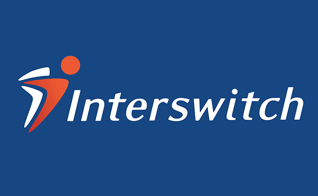

# Interswitch is the Real Bank of Africa

## Overview and Origin
Interswitch is a leading digital payment company incorporated in 2002 in Lagos Nigeria. The company was founded by a young entrepreneur by the name of Mitchell Elegbe who was part of a team that implemented software solutions that enabled Nigerian banks to connect to the Society for Worldwide Interbank Financial Telecommunication (SWIFT)at Computer Systems Associates (CSA) . Mitchell, while engaging with clients realised the enormity of opportunity that exists within the banking space, set off on a journey to establish Interswitch as the bridge linking all banks in Nigeria under one digital platform. At the time, all banks in Nigeria operated in an independent space technology wise and this made it very difficult for regulators to monitor banks, made it very difficult to reconcile funds and also made it difficult for clients to move funds between two different banks. Mitchel foresaw that the investment in technology needed to solve this problem would be massive, decided to go out and seek funding to establish an independent business that will take this burden off banks and regulators and charge rent. 

Interswitch was initially funded with a USD$200,000 contribution from 20 banks in Nigeria and first turned a profit in 2006. By 2010, Helios Investment Partners bought 60% of the company for an undisclosed sum , essentially buying out most of the first funder banks. Shortly afterwards, it acquired controlling stakes in e-payment companies in Uganda and Kenya. Interswitch has since re-invented itself into a transaction switching and electronic payments processing company that builds and manages payment infrastructure as well as deliver innovative payment products and transactional services throughout the African continent. It currently operates in five African countries namely Gambia, Kenya, Nigeria, Rwanda and Uganda. 

In November 2019, Visa took a strategic equity position in Interswitch, doling out USD$200mn for a 20% stake in the company, bringing the company valuation to a whooping USD$1bn

## Business Activities
Interswitch uses its SDK Integration to automate all e-payment solutions, including banking applications. It’s the owner of verve, Africa’s most used payment card, Quickteller- an online payment platform, retailpay and smartgov. 

Interswitch solved the problem of efficiency and interconnectedness within and to the African payments and billing industry. It also manages the infrastructure for innovative payment products and services on which other Fintech companies operate, including POS, ATMs, Web payment and mobile banking. 

Interswitch is essentially a B2B. Its list of clients includes Banks all around Africa, bank regulators, government payment/revenue parastatals eg customs and tax office, brick & mortar businesses as well as web based businesses. Scalable to no end, Interswitch provides a local solution to money movement in the African economy unlike competitors in the global space like Visa and Mastercard. Today the company boasts of revenue of over USD$85.16bn , 93% of which is recurrent revenue, 42 million transactions execute monthly, 32 million verve card users and over 11,000 ATMS connected on its platform. 

## Landscape
Interswitch operates in the payments and billing Fintech domain. In its almost two decades of existence, Interswitch has managed to stay relevant and ahead of the technology curve. When it first launched in 2002, a typical bank deployed technology that only ran from their bank end to their front end. The successful integration of all the banks into one portal led to the CBN launching the the Central Bank of Nigeria (CBN) launched the Payment Systems Vision 2020 (PSV 2020) , a policy aimed at a future cashless society. Innovators who took advantage of this new regulation in Nigeria includes Paga, Paystack, Kudi, Wallets Africa, Mines.io, PiggyVest, Flutterwave, and Cowrywise.

Researchers believe the next phase of innovation in this domain in Africa will be driven by telecommunication companies, in the form of mobile payment. Given the massive success of Safaricom’s M-Pesa in Kenya and MTN’s Mobile Money in Ghana (which currently has the highest growth rate of mobile money in Africa. We should, therefore, expect services around energy, healthcare, education and many more, to launch on the platform of telco-backed MMOs. We also expect to see increased adoption of blockchain and cryptocurrencies. 

## Results
Interswitch achieved two things with its business: 1) it reduced the barrier to entry for consumers exclude from the socio-economic benefits that the financial ecosystem is meant to deliver. @) it ensured that businesses can efficiently improve their products or services while staying competitive and profitable. As a result, prominence of mobile payments, increased start-up activity and innovation, a push for financial inclusion and more regulation. Business owners receive money from clients anywhere in the world in real time. To measure it performance, Interswitch uses metrices around transaction volume and speed. 

## Recommendations
With the rise of cryptocurrency, I believe Interswitch can function as a Crypto exchange. All they need to do is to incorporate blockchain technology into the platform they already have on ground. The benefit of this will be enormous, not only for the company, but also for the businesses that depend on the for payment and billing. 

---
## Addendum
```python
```
[Interswitch](Interswitch_Hompage)

[Fintech](Fintech_History)

[Helios](Helios_investment)

[Performance](Performance)

[Ranking](Ranking)